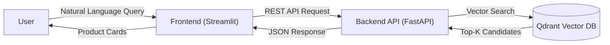

# 🛍️ AI Fashion Stylist: Personalized Recommendation System


> **"I need a red dress for a summer wedding."** -> *Retrieves visually and semantically similar items in milliseconds.*

This project implements an **End-to-End MLOps pipeline** for a real-time fashion recommendation system. It leverages **Semantic Search** using tailored BERT embeddings and a **Vector Database (Qdrant)** to understand user intent beyond keyword matching.

---

## 🏗️ Architecture (Microservices)

The system is designed with scalability in mind, fully containerized using Docker Compose.



* frontend: Streamlit-based interactive UI for users.
* backend: High-performance FastAPI service handling logic & orchestration.
* qdrant: Vector Database storing 100K+ product embeddings for low-latency retrieval.
* etl-worker: An automated service that runs on startup to ingest & embed data if the DB is empty.

## 📂 Dataset Setup

**Important:** Due to the large file size, the dataset is not included in this repository.

1.  **Download:** Access the dataset from the [H&M Personalized Fashion Recommendations](https://www.kaggle.com/competitions/h-and-m-personalized-fashion-recommendations/data) page on Kaggle.
2.  **Extract:** Unzip the downloaded files.
3.  **Place:** Move the CSV files (`articles.csv`, `customers.csv`, `transactions_train.csv`) into the `data/raw/` directory.

## 🚀 Quick Start
You don't need to install Python or libraries manually. Just use Docker.

**Prerequisites**
* Docker & Docker Compose installed.

**Run the System**
```bash
# 1. Clone the repo
git clone https://github.com/enesgulerml/hm-fashion-recommender.git
cd hm-fashion-recommender

# 2. Start the application (It initializes the DB automatically)
docker-compose up --build
```
Once the logs settle, open your browser: 👉 http://localhost:8502

## 🛠️ Tech Stack & Engineering Decisions

| Component | Technology | Engineering Decision (Why?) |
| :--- | :--- | :--- |
| **Embeddings** | `all-MiniLM-L6-v2` | Selected for the best trade-off between inference speed (CPU-friendly) and semantic accuracy for search tasks. |
| **Vector DB** | **Qdrant** | Chosen for its Rust-based high performance, native Docker support, and ease of use compared to heavier alternatives. |
| **Backend API** | **FastAPI** | Utilized for its asynchronous capabilities (handling concurrent requests efficiently) and automatic Swagger UI generation. |
| **Containerization** | **Docker & Compose** | Ensures 100% reproducibility by isolating microservices (API, UI, DB) and dependencies from the host OS. |
| **Data Proc** | **Pandas (Chunking)** | Implemented memory-efficient chunking strategies to process 3.5GB+ transaction logs without causing OOM (Out of Memory) errors. |
| **Frontend** | **Streamlit** | Adopted for rapid prototyping of data-driven interfaces, allowing direct integration with the Python backend. |


## 📂 Project Structure
```text
├── data/               # Raw data (GitIgnored)
├── src/
│   ├── api/            # FastAPI application
│   ├── frontend/       # Streamlit UI
│   ├── ingest_vectors.py # ETL Script for embedding injection
│   └── preprocessing.py  # Data cleaning & optimization
├── docker-compose.yml  # Orchestration of services
├── requirements.txt    # Pinned dependencies
└── README.md           # Documentation
```

## 🧪 Testing
The project includes a robust integration test suite using **Pytest**. It validates the API health, Qdrant vector search functionality, and error handling.

To run the tests locally:

1. Ensure the Docker containers are running:
   ```bash
   docker-compose up -d
    ```
2. Using Conda (Recommended):
    ```bash
    # Create a new environment
    conda create -n hm-recsys-test python=3.10 -y

    # Activate the environment
    conda activate hm-recsys-test

    # Install dependencies
    pip install -r requirements.txt
    ```
3. Execute the test suite:
    ```bash
   pytest tests/ -v 
   ```
   
### Test Coverage:

✅ Health Check: Verifies if the API and ML models are loaded correctly.

✅ Recommendation Flow: Simulates a real user query ("Red party dress") and asserts that Qdrant returns valid product results.

✅ Error Handling: Ensures the API gracefully handles invalid inputs (e.g., missing parameters).

## 📊 Monitoring & Observability

To ensure high availability and performance reliability, this project implements a full observability stack using **Prometheus** and **Grafana**.

### 🛠 Architecture
- **Prometheus:** Scrapes real-time metrics (RPS, Latency, Memory Usage) from the FastAPI backend via `prometheus-fastapi-instrumentator`.
- **Grafana:** Visualizes these metrics in interactive dashboards, allowing us to monitor the impact of Redis caching on inference speed.

### 🔗 Access Points
| Service | URL                                                            | Default Credentials | Description |
|---------|----------------------------------------------------------------|---------------------|-------------|
| **Grafana Dashboard** | [http://localhost:3001](http://localhost:3001)                 | `admin` / `admin` | Real-time visualization of system metrics. |
| **Prometheus UI** | [http://localhost:9091](http://localhost:9091)                 | N/A | Raw metric querying and target status. |
| **API Metrics** | [http://localhost:8001/metrics](http://localhost:8001/metrics) | N/A | Raw metrics endpoint exposed by the application. |

---

## 🛑 Stopping the System

To stop the services while preserving the database and model registry data:
```bash
docker-compose down
```

To stop the services and remove all persistent data volumes (Reset everything to a clean state):

```bash
docker-compose down -v
```

### 📈 Key Metrics to Watch
1.  **Cache Hit vs. Miss Rate:** Demonstrates the efficiency of the Redis layer.
2.  **P99 Latency:** Tracks the response time for the slowest 1% of requests (critical for SLA).
3.  **Request Throughput:** Number of requests processed per second.

## 👨‍💻 Author
Enes Guler - MLOps Engineer & Data Scientist

[LinkedIn](in/enes-güler-8ab8a7346) | [Medium](https://medium.com/@ml.enesguler)