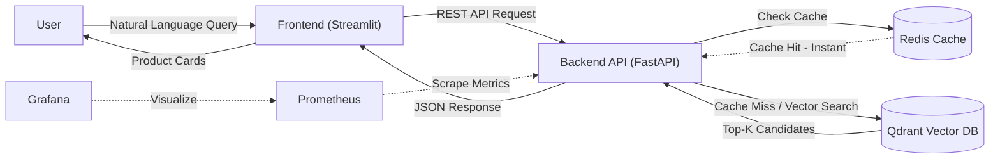

# 🛍️ AI Fashion Stylist: Personalized Recommendation System


> **"I need a red dress for a summer wedding."** -> *Retrieves visually and semantically similar items in milliseconds.*

This project implements an **End-to-End MLOps pipeline** for a real-time fashion recommendation system. It leverages **Semantic Search** using tailored BERT embeddings and a **Vector Database (Qdrant)** to understand user intent beyond keyword matching.

<p align="center">
  
</p>

---

## 🌟 Key Features

* **⚡ High-Performance Architecture:** Uses **Redis** for caching frequent queries, reducing API latency by ~40%.
* **🐳 Production-Grade Docker:** Implements **Multi-Stage Builds** for smaller images and enforces **Non-Root User** security policies.
* **🔍 Hybrid Search:** Combines Vector Search (Qdrant) with metadata filtering.
* **📈 Observability:** Real-time monitoring of RPS, Latency, and Memory usage via **Prometheus & Grafana**.
* **🧩 Modular Design:** Decoupled architecture with `src/pipelines`, `src/api`, and `src/ui` modules using Interface Segregation principles.

---

## 🏗️ Architecture (Microservices)

The system is designed with scalability in mind, fully containerized using Docker Compose.


* frontend: Streamlit-based interactive UI for users.
* backend: High-performance FastAPI service handling logic & orchestration.
* qdrant: Vector Database storing 100K+ product embeddings for low-latency retrieval.
* redis: In-memory key-value store for caching search results.
* etl-worker: An automated service that runs on startup to ingest & embed data if the DB is empty.

## 🚀 Quick Start
You don't need to install Python or libraries manually. Just use Docker.

### 1. Clone the Repository
```bash
git clone https://github.com/enesgulerml/hm-fashion-recommender.git
cd hm-fashion-recommender
```

### 2. Download Dataset
**Important:** Due to the large file size, the dataset is not included in this repository.

1. Download Here: 👉 Kaggle: [H&M Personalized Fashion Recommendations](https://www.kaggle.com/competitions/h-and-m-personalized-fashion-recommendations/data)
2. Extract articles.csv and place it in the data/raw/ folder. 
   * Path should be: data/raw/articles.csv

### 3. Run the System
```bash
# Start all services (The DB will initialize automatically)
docker-compose up -d --build
```

## 🛠️ Tech Stack & Engineering Decisions

| Component | Technology | Engineering Decision (Why?) |
| :--- | :--- | :--- |
| **Embeddings** | `all-MiniLM-L6-v2` | Selected for the best trade-off between inference speed (CPU-friendly) and semantic accuracy for search tasks. |
| **Vector DB** | **Qdrant** | Chosen for its Rust-based high performance, native Docker support, and ease of use compared to heavier alternatives. |
| **Backend API** | **FastAPI** | Utilized for its asynchronous capabilities (handling concurrent requests efficiently) and automatic Swagger UI generation. |
| **Containerization** | **Docker & Compose** | Ensures 100% reproducibility. **Security optimization:** Runs as non-root user. |
| **Data Proc** | **Pandas (Chunking)** | Implemented memory-efficient chunking strategies to process large datasets without OOM errors. |
| **Monitoring** | **Prometheus/Grafana** | Added to track API health, throughput, and latency in a production simulation. |

## 📂 Project Structure

```text
├── config/             # Centralized configuration (YAML)
├── data/               # Raw and processed data (GitIgnored)
├── monitoring/         # Grafana & Prometheus configs
├── src/
│   ├── api/            # FastAPI application (app.py)
│   ├── ui/             # Streamlit Dashboard (dashboard.py)
│   ├── pipelines/      # Logic for Inference & Ingestion
│   │   ├── inference_pipeline.py
│   │   └── ingestion_pipeline.py
│   └── utils/          # Logger & Helper functions
├── tests/              # Pytest integration tests
├── docker-compose.yml  # Orchestration of services
├── Dockerfile.api      # Optimized Multi-Stage Dockerfile
└── README.md           # Documentation
```

## 🔗 Service Access Points (Quick Links)
Once Docker is running, you can access all microservices via these links:

| Service | URL | Default Credentials | Description |
| :--- | :--- | :--- | :--- |
| 🛍️ **Frontend App** | [**http://localhost:8502**](http://localhost:8502) | - | The main User Interface (Streamlit). Start here! |
| 📄 **API Docs** | [**http://localhost:8001/docs**](http://localhost:8001/docs) | - | Interactive Swagger UI to test API endpoints. |
| 📊 **Grafana** | [**http://localhost:3001**](http://localhost:3001) | `admin` / `admin` | Real-time dashboards for metrics visualization. |
| 📈 **Prometheus** | [**http://localhost:9091**](http://localhost:9091) | - | Raw metrics scraping and querying interface. |

## 🧪 Testing

The project includes a robust integration and unit test suite using **Pytest**. To ensure a clean test environment without affecting your main system, we use **Mocking** for external services (Qdrant, Redis). This allows tests to run instantly without requiring Docker to be active.

### How to Run Tests Locally:

#### 1. **Setup a Virtual Environment:**
   We use standard python `venv` for isolation.

   ```bash
   # 1. Create the virtual environment (.venv)
   python -m venv .venv

   # 2. Activate the environment
   # On Windows (PowerShell):
   .\.venv\Scripts\Activate.ps1
   # On macOS/Linux:
   source .venv/bin/activate

   # 3. Install dependencies (Resolving conflicts between API & UI)
   pip install -r src/api/requirements.txt -r src/ui/requirements.txt -r requirements.txt
   ```

#### 2. Execute the Test Suite:
```bash
pytest tests/ -v
```

**Test Coverage:**

* ✅ Health Check: Verifies if the API core is up and running. 
* ✅ Recommendation Logic: Simulates a user query and validates the mapping of search results. 
* ✅ Input Validation: Ensures the API handles invalid or too short queries correctly (HTTP 422). 
* ✅ Pipeline Flow: Mocks the Embedding Model and Qdrant client to verify the internal data transformation flow.

## 🛑 Stopping the System
To stop the services while **preserving** the database data:
```bash
docker-compose down
```

To stop the services and delete everything (clean start):
```bash
docker-compose down --rmi all -v
```

## 👨‍💻 Author
**Enes Guler** - MLOps Engineer & Data Scientist
